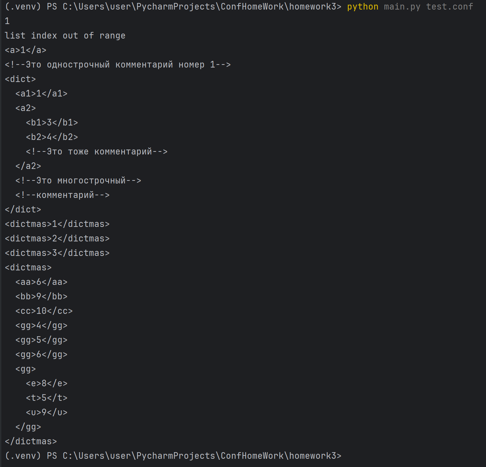

Разработать инструмент командной строки для учебного конфигурационного 
языка, синтаксис которого приведен далее. Этот инструмент преобразует текст из 
входного формата в выходной. Синтаксические ошибки выявляются с выдачей 
сообщений. 
Входной текст на учебном конфигурационном языке принимается из 
файла, путь к которому задан ключом командной строки. Выходной текст на 
языке xml попадает в стандартный вывод.

Тестирование работы:
