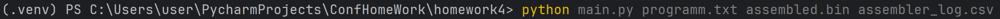
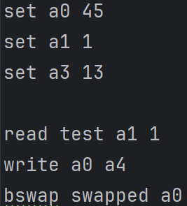
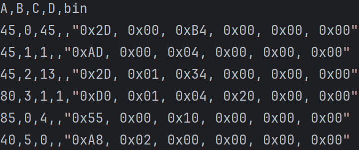
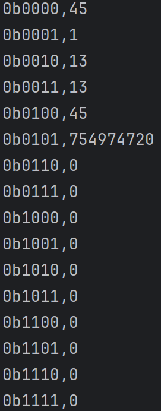

# Задание №4

Разработать ассемблер и интерпретатор для учебной виртуальной машины (УВМ).  
Система команд УВМ представлена далее.

Для ассемблера необходимо разработать читаемое представление команд УВМ. Ассемблер принимает на вход файл с текстом исходной программы, путь к которой задается из командной строки. Результатом работы ассемблера является бинарный файл в виде последовательности байт, путь к которому задается из командной строки. Дополнительный ключ командной строки задает путь к файлулогу, в котором хранятся ассемблированные инструкции в духе списков “ключ=значение”, как в приведенных далее тестах.  

Интерпретатор принимает на вход бинарный файл, выполняет команды УВМ и сохраняет в файле-результате значения из диапазона памяти УВМ. Диапазон также указывается из командной строки.  

Форматом для файла-лога и файла-результата является csv.  

Необходимо реализовать приведенные тесты для всех команд, а также написать и отладить тестовую программу.

### 1. Загрузка константы

**Формат команды**:  
- Адрес: 45  
- Операнд: константа C  
- Результат: значение в памяти по адресу B

**Размер команды**: 6 байт.  
Биты команды:  
- Биты 0—6: Адрес (A)  
- Биты 7—17: Адрес (B)  
- Биты 18—29: Константа (C)  

**Пример**:  
Тест (A=45, B=532, C=557):
0x2D, 0x0A, 0xB5, 0x08, 0x00, 0x00
---

### 2. Чтение значения из памяти

**Формат команды**:  
- Адрес: 80  
- Операнд: адрес (C) и смещение (D)  
- Результат: значение в памяти по адресу B

**Размер команды**: 6 байт.  
Биты команды:  
- Биты 0—6: Адрес (A)  
- Биты 7—17: Адрес (B)  
- Биты 18—28: Адрес (C)  
- Биты 29—43: Смещение (D)  

**Пример**:  
Тест (A=80, B=160, C=93, D=655):
0x50, 0x50, 0x74, 0xE1, 0x51, 0x00

---

### 3. Запись значения в память

**Формат команды**:  
- Адрес: 85  
- Операнд: адрес (B)  
- Результат: значение в памяти по адресу C

**Размер команды**: 6 байт.  
Биты команды:  
- Биты 0—6: Адрес (A)  
- Биты 7—17: Адрес (B)  
- Биты 18—28: Адрес (C)  

**Пример**:  
Тест (A=85, B=177, C=39):
0xD5, 0x58, 0x9C, 0x00, 0x00, 0x00

---

### 4. Унарная операция: `bswap()`

**Формат команды**:  
- Адрес: 40  
- Операнд: адрес (C)  
- Результат: значение в памяти по адресу B, равное значению в памяти по адресу C

**Размер команды**: 6 байт.  
Биты команды:  
- Биты 0—6: Адрес (A)  
- Биты 7—17: Адрес (B)  
- Биты 18—28: Адрес (C)  

**Пример**:  
Тест (A=40, B=949, C=470):
0xA8, 0xDA, 0x59, 0x07, 0x00, 0x00

---

## Тестирование
Программа успешно прошла тестирование 
#### Запуск программы:

#### Исходная программа:  
  
  
#### Файл-лог:  

  
#### Файл-результат:  

